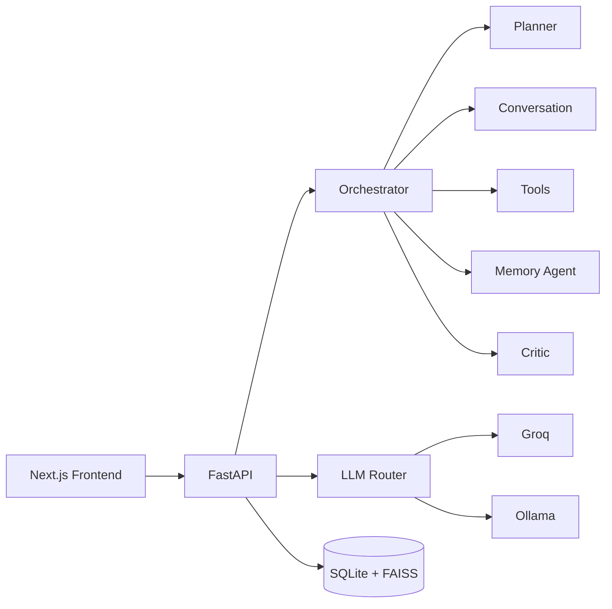

# ATEE Core

**ATEE** — *AI Companion for Thoughtful Evolution & Emotion*

A local-first AI companion with multi-agent orchestration, hybrid LLM routing (Groq + Ollama), semantic memory (FAISS + SQLite), emotion-aware personality, and a Next.js voice/chat frontend.

[](LICENSE)

## Features

- **Multi-agent cognitive loop** — planner, conversation, tools, memory, and critic agents coordinated by an orchestrator
- **Hybrid LLM routing** — fast Groq models for simple turns; larger models when complexity warrants it; Ollama fallback for offline/local use
- **Layered memory** — short-term conversation buffer, long-term SQLite store, and FAISS vector recall with importance scoring
- **Voice I/O** — WebSocket streaming, faster-whisper STT, and Coqui TTS on the backend
- **Emotion & personality** — tone detection and adaptive response styles
- **Built-in tools** — web search, reminders, file ops, and system utilities via a tool registry

## Repository layout

```
atee-core/
├── backend/          # FastAPI application (Python 3.12+)
│   ├── app/          # Agents, API, LLM, memory, voice, tools
│   ├── data/         # Runtime DB & indexes (gitignored; .gitkeep only)
│   └── requirements.txt
├── frontend/         # Next.js 16 web UI
└── LICENSE
```

## Prerequisites

| Component | Version |
|-----------|---------|
| Python | 3.12+ |
| Node.js | 20+ |
| [Groq API key](https://console.groq.com/) | Required for cloud LLM |
| [Ollama](https://ollama.com/) | Optional local fallback |

Voice features pull additional model weights on first run (Whisper, Coqui TTS) and need sufficient disk/RAM.

## Quick start

### 1. Backend

```bash
cd backend
python -m venv venv

# Windows
venv\Scripts\activate

# macOS / Linux
source venv/bin/activate

pip install -r requirements.txt
cp .env.example .env
# Edit .env — set GROQ_API_KEY at minimum

uvicorn app.main:app --reload --host 0.0.0.0 --port 8000
```

API docs: [http://localhost:8000/docs](http://localhost:8000/docs)

### 2. Frontend

```bash
cd frontend
npm install
cp .env.example .env.local
npm run dev
```

Open [http://localhost:3000](http://localhost:3000).

## Configuration

Copy `backend/.env.example` to `backend/.env` and set:

| Variable | Description |
|----------|-------------|
| `GROQ_API_KEY` | Groq API key (required for cloud inference) |
| `GROQ_FAST_MODEL` | Fast model id (default: `llama-3.1-8b-instant`) |
| `GROQ_POWER_MODEL` | Power model id (default: `llama-3.3-70b-versatile`) |
| `OLLAMA_BASE_URL` | Ollama URL when using local models |
| `SQLITE_DB_PATH` | SQLite path (default: `./data/atee.db`) |
| `FAISS_INDEX_PATH` | Vector index directory |
| `CORS_ORIGINS` | JSON array of allowed frontend origins |
| `APP_NAME` | Display name (default: `ATEE`) |

Never commit `.env` files or API keys.

## API overview

| Method | Path | Description |
|--------|------|-------------|
| `GET` | `/api/v1/health` | Health and component status |
| `POST` | `/api/v1/chat` | Chat with memory + LLM routing |
| `WS` | `/api/v1/chat/ws` | Streaming chat |
| `GET/POST` | `/api/v1/memory/*` | Memory inspection and management |
| `WS` | `/api/v1/voice/stream` | Voice streaming |

## Development

```bash
# Backend lint/format (from backend/)
ruff check app
black app

# Frontend lint
cd frontend && npm run lint
```

Runtime artifacts (`backend/data/*.db`, FAISS indexes, logs, `venv/`, `node_modules/`) are excluded via `.gitignore`.

## Architecture



## License

MIT — see [LICENSE](LICENSE).

## Author

[abhijeet454](https://github.com/abhijeet454)
